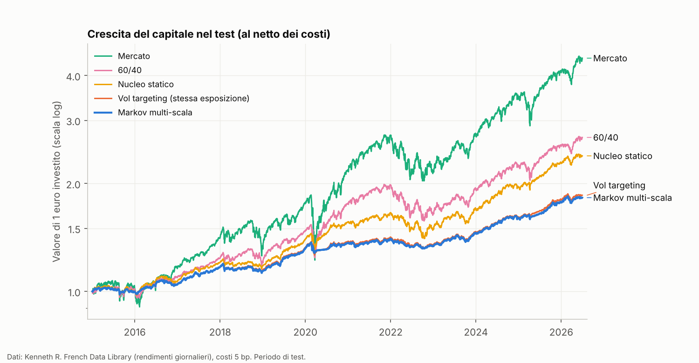
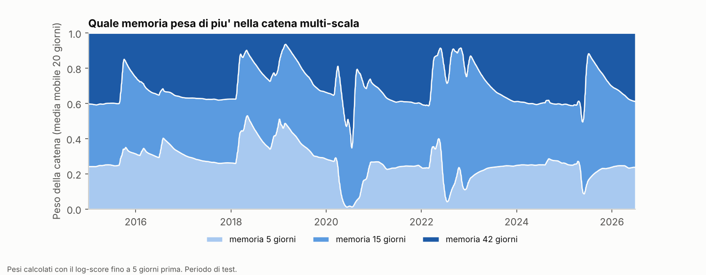
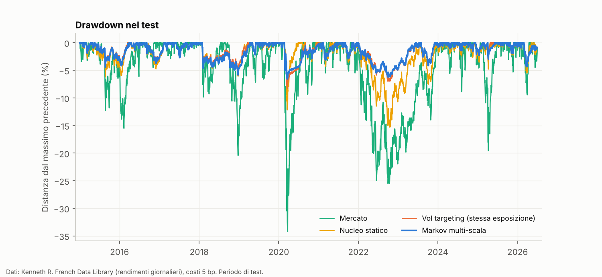
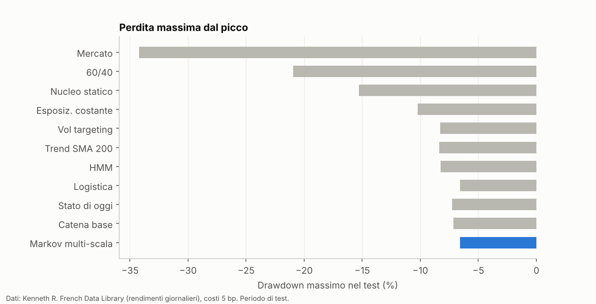
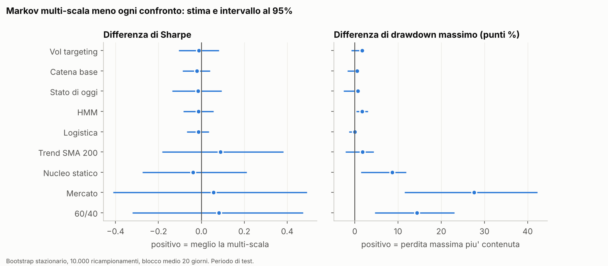
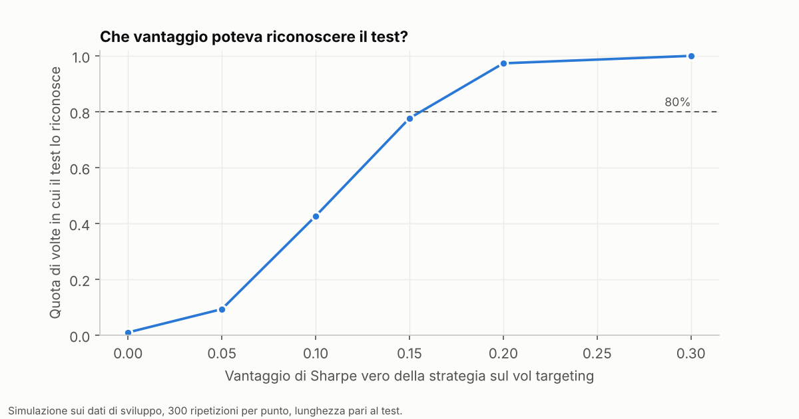
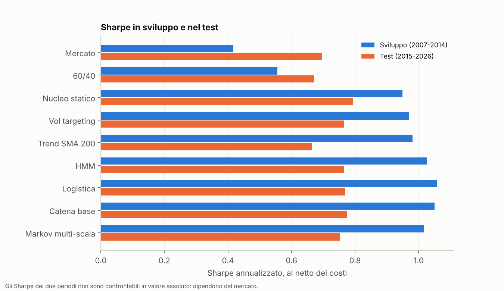
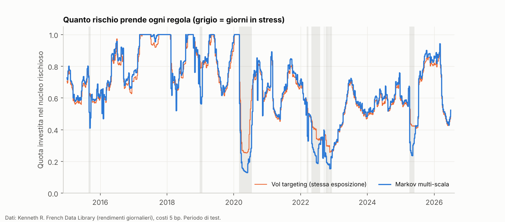
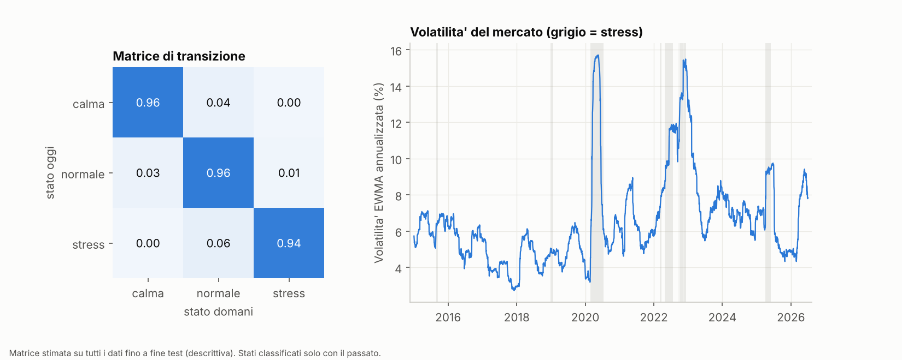

# Allocazione adattiva con una catena di Markov sui regimi di volatilità

In questo progetto costruisco un portafoglio virtuale che riduce il rischio quando la volatilità del mercato fa pensare a uno stress imminente. La probabilità di stress viene da una catena di Markov stimata su regimi di volatilità osservabili. Poi la confronto, fuori campione, con regole molto più semplici (vol targeting, esposizione costante, un HMM, una regressione logistica, un filtro di tendenza).

La domanda è: **la catena aggiunge qualcosa rispetto a regole più semplici?** Il README descrive come l'ho verificato, in modo che il risultato si possa controllare anche se la risposta è no.

## Indice

1. [Risultato in breve](#1-risultato-in-breve)
2. [Come ho organizzato il lavoro](#2-come-ho-organizzato-il-lavoro)
3. [Dati](#3-dati)
4. [Regimi di volatilità](#4-regimi-di-volatilità)
5. [Catena di Markov e probabilità di stress](#5-catena-di-markov-e-probabilità-di-stress)
6. [La variante multi-scala](#6-la-variante-multi-scala)
7. [Regola di allocazione](#7-regola-di-allocazione)
8. [Benchmark e concorrenti](#8-benchmark-e-concorrenti)
9. [Come ho scelto i parametri](#9-come-ho-scelto-i-parametri)
10. [Come misuro i risultati](#10-come-misuro-i-risultati)
11. [Risultati sullo sviluppo](#11-risultati-sullo-sviluppo)
12. [Risultati sul test](#12-risultati-sul-test)
13. [La parte previsiva da sola](#13-la-parte-previsiva-da-sola)
14. [Controlli contro l'uso del futuro e test del codice](#14-controlli-contro-luso-del-futuro-e-test-del-codice)
15. [Limiti](#15-limiti)
16. [Come riprodurre i numeri](#16-come-riprodurre-i-numeri)
17. [Struttura del repository](#17-struttura-del-repository)
18. [Riferimenti](#18-riferimenti)

---

## 1. Risultato in breve

Sul periodo di test (gennaio 2015 – giugno 2026, 2.889 giorni di borsa, costi di 5 punti base):

- **Il drawdown è molto più basso di mercato, 60/40 e nucleo statico.** Il drawdown massimo è del 6,6%, contro il 34,2% del mercato, il 20,9% del 60/40 e il 15,3% del nucleo statico (gli stessi strumenti sempre investiti). Contro questi tre confronti l'intervallo di confidenza al 95% sulla differenza è tutto a favore della strategia. Contro il vol targeting (8,3%) e l'esposizione costante (10,2%) la differenza non è distinguibile da zero.
- **Lo Sharpe non migliora.** 0,753 per la strategia, contro 0,697 del mercato, 0,671 del 60/40 e 0,792 del nucleo statico. La stima è più alta di mercato e 60/40, più bassa del nucleo statico; nessuna differenza è distinguibile da zero.
- **La catena di Markov non aggiunge valore dimostrabile rispetto a regole più semplici.** Contro il vol targeting con la stessa esposizione media la differenza di Sharpe è −0,012, con intervallo al 95% [−0,106; +0,082]. Anche catena base, stato corrente, HMM e regressione logistica non si distinguono.
- **Il test ha una potenza limitata.** In una simulazione con la stessa lunghezza, un vantaggio vero di 0,10 di Sharpe viene riconosciuto nel 43% dei casi (circa ±3 punti) e uno di 0,15 nel 78%. L'estremo superiore dell'intervallo è +0,082: un vantaggio sul vol targeting, se esiste, è piccolo, ma non posso escludere che esista.

In sintesi: la riduzione del drawdown viene dal tenere meno rischio quando la volatilità sale, cosa che fa anche il vol targeting. Non vedo un contributo specifico della catena di Markov.



## 2. Come ho organizzato il lavoro

Per non ingannarmi da solo ho diviso il periodo in due parti e fissato le regole prima di guardare i risultati.

- **Sviluppo**: fino al 31 dicembre 2014. Qui ho scelto i parametri e provato le idee.
- **Test**: dal 1° gennaio 2015 a giugno 2026. L'analisi principale (`06_inferenza.py test`) l'ho lanciata **una sola volta**, dopo aver congelato le configurazioni in `config_congelata.json`. Lo script in modalità test si rifiuta di partire se il file non c'è, se non coincide con le scelte fatte sullo sviluppo o se esiste già un esito completo. L'analisi della parte previsiva (sezione 13), i grafici e il notebook li ho fatti dopo, sugli stessi dati e senza cambiare nessuna scelta: sono letture aggiuntive, non una seconda occasione.
- Prima del test ho scritto che cosa avrei considerato un risultato positivo (testo in [docs/criteri_del_verdetto.md](docs/criteri_del_verdetto.md); il repository non ha una prova della data, quindi questa è una mia dichiarazione). Livello 1: la strategia è utile? (drawdown più basso e Sharpe non peggiore rispetto a mercato, 60/40 e nucleo statico, al netto dei costi). Livello 2: la catena aggiunge valore? La misura è una sola: la differenza di Sharpe contro il vol targeting con la stessa esposizione media, con intervallo al 95%. Evidenza se l'intervallo è tutto favorevole e il segno regge con costi a 10 punti base e nei sottoperiodi 2015-2019 e 2020-2026; indicazione debole se la stima è favorevole ma l'intervallo include lo zero; negli altri casi, nessun valore aggiunto.
- Esito: **nessun valore aggiunto dimostrabile** (sezione 12). Livello 1: soddisfatto sul drawdown; sullo Sharpe la stima contro il nucleo statico è più bassa (−0,039), quindi non soddisfatto sulla stima puntuale.

La **variante multi-scala** (sezione 6) è nata dopo aver visto, nello sviluppo, che la catena semplice non prevedeva la volatilità meglio di EWMA e HAR: non è un'idea precedente ai risultati. Il test però non era ancora stato toccato.

## 3. Dati

Tutti i dati sono gratuiti.

| Serie | Fonte | Note |
|---|---|---|
| Mercato (Mkt) | Kenneth R. French Data Library, fattori giornalieri | Mkt-RF + RF, rendimenti a valore ponderato con dividendi reinvestiti |
| NoDur (beni di consumo non durevoli) | French, 10 portafogli per industria | HiTec viene letta ma serve solo per i controlli sui dati |
| Chips (semiconduttori) | French, 49 portafogli per industria | |
| Liquidità (RF) | French, stesso file dei fattori | tasso giornaliero, equivalente al tasso a 1 mese dei Treasury |
| Obbligazioni (Bond7) | rendimenti a scadenza costante a 7 anni pubblicati dal Dipartimento del Tesoro USA (file annuali CSV dal 2000, già scaricati per un altro mio progetto; `data/treasury/cmt.csv`) | rendimento totale stimato di un titolo alla pari: cedola maturata, durata e convessità; il rullaggio sulla curva è ignorato |
| Oro | GLD, file giornaliero in formato Stooq | rendimento del prezzo (GLD non paga dividendi); le spese di gestione dell'ETF sono già nel prezzo, a differenza degli indici |

Il calendario è quello di French (26.274 giorni dal luglio 1926 al 30 giugno 2026). L'allocazione parte dal 28 febbraio 2005 (primo giorno con tutte le serie, perché c'è l'oro) e le metriche partono dopo 504 giorni di avviamento (1° marzo 2007).

**Perché indici e non ETF.** Avevo i file giornalieri di alcuni ETF (SPY, IEF, ecc.), ma nei giorni di stacco dividendo il prezzo scendeva del dividendo (per SPY −0,32% in media contro +0,04% negli altri giorni), cioè non erano rendimenti totali. Ho quindi usato gli indici di French, che sono a rendimento totale. Gli ETF li ho usati solo come controllo di coerenza (correlazione giornaliera con Mkt 0,986 per SPY e con Bond7 0,931 per IEF, nel 2005-2014). Questi controlli li ho fatti una tantum con i file locali degli ETF, che non sono nel repository: i numeri su ETF di questo paragrafo non si riproducono con gli script.

Controlli sui dati (`scripts/01_controlla_dati.py`): nessun valore mancante nelle serie azionarie e in RF; dal 2005 manca solo il primo rendimento dell'oro e il 17 febbraio 2011 nel file GLD (il rendimento del giorno dopo copre due giorni); 39 giorni di borsa dal 2005 senza dato del Tesoro (festivi del mercato obbligazionario), dove uso l'ultimo valore.

**I dati non sono nel repository**, tranne il file piccolo del Tesoro. I file di French si scaricano con `scripts/00_scarica_dati.py`, che controlla il robots.txt del sito prima di ogni richiesta e aspetta 2 secondi tra una richiesta e l'altra. Il file di GLD va messo a mano in `data/raw/gld.us.txt` (non ho letto i termini di Stooq per la ridistribuzione, quindi non lo includo).

## 4. Regimi di volatilità

Il mercato è descritto dai rendimenti logaritmici dell'indice Mkt.

1. **Volatilità EWMA**: varianza con media mobile esponenziale, λ = 0,94 (valore classico di RiskMetrics per i dati giornalieri), annualizzata con √252.
2. **Tre stati**: calma sotto il quantile 0,40 della volatilità, stress sopra il quantile 0,90 (nella griglia provo anche 0,80), normale in mezzo.
3. **Soglie solo dal passato.** I quantili sono calcolati su tutta la storia fino a quel giorno (finestra espandibile, minimo 252 giorni). Lo stato di ogni giorno passato è quello assegnato quel giorno e **non viene mai riclassificato** con soglie successive. Se lo facessi, la matrice di transizione userebbe informazione del futuro.

Soglie, matrici e modelli usano tutta la storia di Mkt disponibile (dal 1926), non solo dal 2005. Nel periodo di sviluppo (2005-2014) gli stati sono: calma 21,9%, normale 63,1%, stress 14,9% dei giorni.

## 5. Catena di Markov e probabilità di stress

- **Matrice di transizione**: conto, giorno per giorno, quante volte si è passati da uno stato all'altro tra i giorni già osservati, con lisciamento di Laplace (alfa = 1) per evitare probabilità esattamente zero. Alla fine dello sviluppo la diagonale è 0,962 / 0,961 / 0,941: i regimi sono molto persistenti.
- **Probabilità di stress a 5 giorni**: p(t) = elemento (stato di oggi, stress) della matrice elevata alla quinta. Cinque giorni sono una settimana di borsa, la frequenza con cui ribilancio.

Un test di ordine (rapporto di verosimiglianza tra catena di ordine 1 e di ordine 2, 12 gradi di libertà) **rifiuta** l'ipotesi di Markov di ordine 1: LR = 119,6 nello sviluppo (p < 10⁻¹⁴) e 34,9 nel test (p = 0,0005). I regimi hanno quindi più memoria di un giorno. Il confronto tra la durata dei periodi osservata e quella geometrica implicita nella matrice conferma la cosa (sezione 13). Le osservazioni sono dipendenti, quindi il chi quadro è solo approssimato.

## 6. La variante multi-scala

Dato che la memoria di un giorno non basta, ho provato a usare tre catene con memorie diverse della volatilità: 5, 15 e 42 giorni di borsa (λ = 1 − 2/(N+1)). Ogni catena ha i suoi stati e la sua probabilità di stress. Le tre probabilità vengono combinate con pesi proporzionali a exp(−η · perdita media scontata), con η = 10 e sconto 0,99. La perdita è il log-score su un evento comune (lo stress della catena a 15 giorni, tra 5 giorni). Al giorno t uso solo perdite già note, cioè fino a t − 5, perché l'esito del giorno u si conosce al giorno u + 5.

η e lo sconto non sono ottimizzati: li ho fissati in anticipo. La regola per passare all'allocazione (errore QLIKE sulla varianza inferiore alla catena base, statistica di Diebold-Mariano ≤ −2) e la sensibilità a η e allo sconto (QLIKE tra 0,4317 e 0,4365) riguardano la versione che combina le **previsioni di varianza** con pesi da QLIKE. La strategia usa invece la versione che combina le **probabilità di stress**, con pesi dal log-score: per questa non ho una regola di passaggio né una sensibilità separata. Nello sviluppo la regola sulla varianza è superata: differenza −0,031, t = −3,58. Contro la sola catena a 15 giorni la differenza è più piccola (−0,013, t = −1,89), quindi parte del miglioramento sulla catena base può venire dalla memoria più lunga e non dalla combinazione.



## 7. Regola di allocazione

**Nucleo rischioso**: NoDur, Mkt, Chips, Bond7, Oro. I pesi sono proporzionali all'inverso della volatilità a 60 giorni di ciascuno. Il resto del capitale sta in liquidità (RF).

**Esposizione.** Con σ_nucleo = deviazione standard a 60 giorni (annualizzata) della serie ottenuta applicando i pesi di oggi agli ultimi 60 rendimenti:

```
L(t) = min(1, m · σ_rif · (1 − (1 − r) · p(t)) / σ_nucleo(t))
```

- `σ_rif` è la mediana di σ_nucleo tra il 60° e il 504° giorno di avviamento (0,0532), poi resta costante: serve a rendere l'obiettivo relativo al nucleo invece di un 10% scelto a caso. Dipende dal periodo di avviamento (2005-2007), che è stato calmo: tutti i livelli di esposizione sono ancorati a quel periodo.
- `m` scala il rischio obiettivo; `r` è la quota di rischio che tengo anche quando la probabilità di stress è 1 (r = 0,25: in stress porto il rischio a un quarto).
- Niente leva: L ≤ 1. Se p = 0 la regola è il semplice vol targeting (tenere la volatilità del portafoglio vicino a un obiettivo).

**Tempi.** Decido l'ultimo giorno di borsa di ogni settimana, con i dati fino alla chiusura (giorno d). L'ordine viene eseguito alla chiusura del giorno d+1 e il portafoglio guadagna dal giorno d+2. Tra un ribilanciamento e l'altro i pesi derivano con i prezzi. La probabilità p guarda 5 giorni avanti dal giorno d, ma il portafoglio detiene la posizione da d+2 a circa d+7: c'è uno scarto di due giorni che non ho cercato di correggere.

**Costi**: 5 punti base sul turnover (somma dei valori assoluti delle variazioni di peso) delle sole gambe rischiose. Sensibilità a 0, 10 e 25 punti base nella sezione 12.

## 8. Benchmark e concorrenti

| Nome nei risultati | Che cos'è |
|---|---|
| mercato | indice Mkt, comprato e tenuto |
| 60_40 | 60% Mkt e 40% Bond7, ribilanciato ogni mese |
| nucleo_statico | gli stessi 5 strumenti con gli stessi pesi, sempre investito (L = 1) |
| vol_target | stessa formula con p = 0, cioè solo vol targeting, m scelto sullo sviluppo |
| vol_target_pari | vol targeting con m scelto perché l'esposizione media coincida con quella della strategia nella finestra in esame |
| esposizione_costante | nucleo statico moltiplicato per l'esposizione media della strategia |
| stato | la stessa formula con p = 1 se oggi lo stato è stress, 0 altrimenti: isola l'effetto della matrice da quello di aver discretizzato la volatilità |
| base | catena a un giorno di memoria |
| hmm | modello di Markov nascosto gaussiano a 3 stati, EM scritto in numpy, solo filtro in avanti, riaddestrato ogni anno (dal 1998) su dati passati |
| logistica | regressione logistica L2 (IRLS) con 5 variabili: log EWMA, log volatilità realizzata a 5/22/66 giorni, log(1 + giorni di permanenza nello stato), riaddestrata ogni 252 giorni |
| trend | uno strumento resta in portafoglio se il suo prezzo è sopra la media mobile a 200 giorni |
| multi | la strategia principale: catena multi-scala |

Il **vol targeting a esposizione pari** e l'**esposizione costante** usano l'esposizione media della strategia, che si conosce solo a posteriori: sono confronti favorevoli ai benchmark.

## 9. Come ho scelto i parametri

Per ogni strategia con probabilità di stress provo una griglia di 12 configurazioni: `q_alto` in {0,80; 0,90}, `m` in {0,8; 1,0; 1,2}, `r` in {0,25; 0,50}. Sullo sviluppo scelgo lo Sharpe netto più alto; se due configurazioni sono entro 0,02 vince quella con meno turnover. Lo stesso criterio vale per tutte le strategie, così nessuna ha più «sforzo di taratura» delle altre. Il vol targeting prova 3 valori di `m`, l'HMM 6 configurazioni, il trend ha la finestra fissata a 200 giorni (100 e 250 solo come sensibilità).

Configurazioni scelte (file `config_congelata.json`): multi, base, stato e logistica scelgono `q_alto` = 0,90, `m` = 0,8, `r` = 0,25; il vol targeting `m` = 0,8; l'HMM `m` = 1,0 e `r` = 0,50.

`m` = 0,8 e `r` = 0,25 sono i **valori più bassi della griglia**: l'ottimo potrebbe stare fuori. Non ho allargato la griglia dopo aver visto i risultati.

Tentativi contati per il Deflated Sharpe: 57 celle di griglia più 3 finestre del trend, cioè 60. Non includono gli iperparametri della multi-scala (memorie, η, sconto, λ, quantili) né la scelta della variante; 192 è un valore prudenziale scelto da me, senza una derivazione.

## 10. Come misuro i risultati

- **Previsione della varianza**: confronto con EWMA e con un HAR (regressione sulla varianza realizzata a 1, 5 e 22 giorni, Corsi 2009), con perdita QLIKE (Patton 2011) e test di Diebold-Mariano.
- **Metriche**: Sharpe sull'eccesso rispetto a RF (media/deviazione standard × √252), rendimento composto annuo, volatilità, drawdown massimo (con il capitale iniziale 1 come punto di partenza), turnover annuo, esposizione media.
- **Bootstrap stazionario** (Politis e Romano), 10.000 ricampionamenti, blocco medio 20 giorni, con gli stessi indici per strategia e confronto, per le differenze di Sharpe e di drawdown massimo (intervallo al 95%). Il drawdown dipende dal percorso: con i blocchi è poco stabile, e lo tengo in conto nella lettura.
- **Commissione di performance** (Fleming, Kirby e Ostdiek): quanto, in punti base annui, un investitore con utilità quadratica e avversione al rischio γ = 1, 5, 10 sarebbe disposto a pagare per passare dal vol targeting alla strategia. Calcolata sui rendimenti semplici (1 + r), al netto dei costi di transazione.
- **Alfa** della strategia rispetto al nucleo statico (stile Moreira e Muir; Cederburg e coautori mettono in dubbio la tenuta fuori campione di queste strategie), con errori standard di Newey-West a 20 e 60 ritardi.
- **Deflated Sharpe** (Bailey e López de Prado): probabilità che lo Sharpe vero superi quello massimo atteso tra N prove con Sharpe vero nullo. Lo applico ai rendimenti del test, dove la selezione non è avvenuta, quindi lo uso come controllo e non come prova. Non misura se la catena aggiunge valore.
- **Placebo**: la serie p(t) viene traslata ciclicamente di un ritardo casuale di almeno un anno (1.000 traslazioni). Conserva distribuzione e persistenza di p ma rompe il legame con i rendimenti. Il valore è la quota di traslazioni con Sharpe pari o superiore a quello della strategia.
- **Potenza** (Monte Carlo): ricampiono a blocchi le coppie di rendimenti dello sviluppo (strategia, vol targeting a esposizione pari), sposto la strategia di una costante in modo che la differenza di Sharpe vera sia nota, e conto quante volte la regola di decisione (bootstrap con intervallo al 95%) la riconosce. Il bootstrap interno usa 400 ricampionamenti (non 10.000) per tenere i tempi accettabili; i 1.975 giorni di sviluppo sono ricampionati fino alla lunghezza del test. Non simula dalla catena (sarebbe circolare): conserva solo dipendenza temporale e code dello sviluppo.
- **Semi del generatore casuale**: fissi (bootstrap, placebo, potenza); non ho verificato quanto cambino gli intervalli con semi diversi.

## 11. Risultati sullo sviluppo

Periodo 1° marzo 2007 – 31 dicembre 2014 (comprende il 2008), costi 5 punti base. Questi sono i numeri su cui ho scelto le configurazioni, quindi sono ottimistici per costruzione.

| | Sharpe | Rendimento | Volatilità | Drawdown | Turnover annuo | Esposizione media |
|---|---|---|---|---|---|---|
| mercato | 0,418 | 7,9% | 22,4% | −54,6% | 0,13 | 1,00 |
| 60/40 | 0,556 | 7,0% | 12,2% | −32,3% | 0,42 | 0,99 |
| nucleo statico | 0,949 | 8,6% | 8,3% | −18,7% | 1,65 | 1,00 |
| esposizione costante | 0,950 | 5,3% | 4,8% | −10,8% | 0,95 | 0,58 |
| vol targeting (m = 0,8) | 0,979 | 5,3% | 4,6% | −9,1% | 1,54 | 0,63 |
| vol targeting a esposizione pari | 0,971 | 4,9% | 4,3% | −8,3% | 1,44 | 0,58 |
| trend (SMA 200) | 0,981 | 6,6% | 6,0% | −8,6% | 4,58 | 0,75 |
| HMM | 1,027 | 6,0% | 5,1% | −8,7% | 2,34 | 0,73 |
| logistica | 1,057 | 5,1% | 4,1% | −5,7% | 1,87 | 0,59 |
| stato corrente | 1,073 | 5,1% | 4,1% | −4,5% | 1,98 | 0,58 |
| catena base | 1,050 | 5,0% | 4,1% | −5,7% | 1,84 | 0,58 |
| **multi-scala** | 1,017 | 4,9% | 4,1% | −6,7% | 1,82 | 0,58 |

Tutti i segnali basati sulla volatilità (multi, base, stato, HMM, logistica) stanno tra 1,02 e 1,07 di Sharpe e sono appena sopra il vol targeting (0,97-0,98). Le loro esposizioni sono quasi la stessa serie: la correlazione tra L(t) della multi-scala e quella del vol targeting è 0,968, con lo stato corrente 0,973, con la catena base 0,987. Con correlazioni così, le differenze di rendimento non si possono attribuire alla matrice con sicurezza. La multi-scala non batte né la catena base né lo stato corrente.

Prima del test ho anche fatto una prova generale della stessa analisi sullo sviluppo (`06_inferenza.py sviluppo`): nessun confronto «della stessa famiglia» aveva una differenza di Sharpe distinguibile da zero. Una verifica a parte con ri-selezione annuale dei parametri (`08_walk_forward_sviluppo.py`, 2009-2014) dà Sharpe 1,307 contro 1,401 della configurazione fissa e 1,412 del vol targeting con m = 0,8: in quel sottoperiodo il vol targeting semplice eguaglia la strategia.

## 12. Risultati sul test

Periodo 1° gennaio 2015 – 30 giugno 2026, 2.889 giorni, costi 5 punti base. Output integrale in [docs/esito_test.txt](docs/esito_test.txt) (copia di quello prodotto da `06_inferenza.py test`).

| | Sharpe | Rendimento | Volatilità | Drawdown | Turnover annuo | Esposizione media |
|---|---|---|---|---|---|---|
| mercato | 0,697 | 14,0% | 18,2% | −34,2% | 0,09 | 1,00 |
| 60/40 | 0,671 | 9,0% | 10,6% | −20,9% | 0,23 | 1,00 |
| nucleo statico | 0,792 | 7,9% | 7,3% | −15,3% | 1,55 | 1,00 |
| esposizione costante | 0,793 | 6,0% | 4,9% | −10,2% | 1,04 | 0,67 |
| vol targeting (m = 0,8) | 0,770 | 5,8% | 4,8% | −8,7% | 1,70 | 0,71 |
| vol targeting a esposizione pari | 0,765 | 5,5% | 4,5% | −8,3% | 1,63 | 0,67 |
| trend (SMA 200) | 0,665 | 5,6% | 5,3% | −8,4% | 4,99 | 0,71 |
| HMM | 0,766 | 6,1% | 5,2% | −8,3% | 2,42 | 0,80 |
| logistica | 0,768 | 5,5% | 4,4% | −6,6% | 2,06 | 0,68 |
| stato corrente | 0,769 | 5,5% | 4,4% | −7,3% | 2,28 | 0,67 |
| catena base | 0,775 | 5,5% | 4,4% | −7,1% | 2,12 | 0,67 |
| **multi-scala** | 0,753 | 5,4% | 4,4% | −6,6% | 2,16 | 0,67 |

La strategia rende meno del mercato per due motivi: il nucleo (con obbligazioni e oro) rende già meno (nucleo statico 7,9% contro 14,0%) e la strategia ne investe in media il 67%.





### Differenze con intervallo al 95%

Differenza «multi-scala meno confronto». Per il drawdown la differenza è positiva quando la multi-scala perde meno.

| Confronto | Δ Sharpe | IC 95% | Δ drawdown | IC 95% |
|---|---|---|---|---|
| vol targeting a esposizione pari | −0,012 | [−0,106; +0,082] | +0,017 | [−0,008; +0,023] |
| esposizione costante | −0,039 | [−0,274; +0,211] | +0,037 | [−0,021; +0,048] |
| vol targeting | −0,016 | [−0,110; +0,080] | +0,021 | [−0,004; +0,031] |
| stato corrente | −0,016 | [−0,136; +0,094] | +0,007 | [−0,026; +0,012] |
| catena base | −0,021 | [−0,087; +0,041] | +0,006 | [−0,017; +0,006] |
| HMM | −0,013 | [−0,083; +0,057] | +0,017 | [+0,003; +0,030] |
| logistica | −0,014 | [−0,068; +0,035] | 0,000 | [−0,013; +0,005] |
| trend | +0,088 | [−0,182; +0,382] | +0,018 | [−0,021; +0,044] |
| nucleo statico | −0,039 | [−0,275; +0,212] | +0,087 | [+0,015; +0,119] |
| mercato | +0,057 | [−0,411; +0,492] | +0,276 | [+0,115; +0,423] |
| 60/40 | +0,082 | [−0,322; +0,474] | +0,144 | [+0,047; +0,230] |



Sul drawdown l'intervallo esclude lo zero a favore della multi-scala contro mercato, 60/40, nucleo statico e, per poco, HMM. Non lo esclude contro vol targeting, catena base, stato corrente e regressione logistica: la riduzione del rischio la danno anche loro.

### Altri controlli (tutti contro il vol targeting a esposizione pari, se non indicato)

- **Sottoperiodi** (divisione al 1° gennaio 2020): differenza di Sharpe −0,041 fino al 2019 e −0,009 dal 2020. Contro l'esposizione costante: −0,006 e −0,165. Il segno è negativo in entrambe le parti.
- **Costi**: differenza di Sharpe −0,005 con 0 bp, −0,018 con 10 bp, −0,038 con 25 bp.
- **Commissione di performance**: −13,7 / −11,6 / −8,9 punti base annui per γ = 1 / 5 / 10, cioè negativa.
- **Alfa sul nucleo statico**: +0,13% annuo, t = 0,24 (20 e 60 ritardi), beta 0,55.
- **Placebo**: il 42,7% delle traslazioni cicliche di p ha Sharpe pari o superiore a quello della strategia: il tempismo del segnale non si distingue da un segnale casuale con le stesse caratteristiche.
- **Deflated Sharpe**: 0,982 con 60 prove e 0,979 con 192. Lo Sharpe resta positivo dopo la selezione, ma questo non dice nulla sul valore aggiunto della catena.
- **Per regime** (stato del giorno prima): nei giorni di stress (10,3% del totale) la multi-scala ha eccesso annuo +1,6% con volatilità 4,7%, il nucleo statico +13,8% con volatilità 13,0%: la strategia ha ridotto il rischio e ha rinunciato ai rimbalzi.

### Quanto poteva vedere il test



| Vantaggio di Sharpe vero | 0,00 | 0,05 | 0,10 | 0,15 | 0,20 | 0,30 |
|---|---|---|---|---|---|---|
| Intervallo tutto positivo | 1,0% | 9,3% | 42,7% | 77,7% | 97,3% | 100% |

(300 ripetizioni per punto, quindi un errore di circa ±3 punti percentuali sui valori intermedi; lunghezza uguale al test.) Con vantaggio nullo l'intervallo risulta tutto positivo in 3 casi su 300. In pratica: un vantaggio grande lo avrei visto, uno piccolo (fino a 0,10) spesso no.

### Sviluppo e test a confronto



Nel test lo Sharpe delle strategie adattive scende rispetto allo sviluppo, mentre mercato e 60/40 salgono (periodo più favorevole alle azioni). Il leggero vantaggio della multi-scala sul vol targeting che c'era nello sviluppo (+0,046) sparisce (−0,012).



## 13. La parte previsiva da sola

Separo la domanda «la catena prevede bene?» da «l'allocazione rende?». `scripts/10_analisi_descrittive.py` valuta la parte previsiva sullo sviluppo e sul test separatamente (output in `output/descrittive.txt`).

**Varianza a 5 giorni** (errore QLIKE, più basso è meglio; test di Diebold-Mariano con errori standard di Newey-West a 10 ritardi):

| | Sviluppo | Test |
|---|---|---|
| multi-scala | 0,4327 | 0,5319 |
| catena base | 0,4638 | 0,5789 |
| EWMA | 0,3838 | 0,5330 |
| HAR | 0,3724 | 0,4625 |
| multi − base (t) | −0,031 (−3,58) | −0,047 (−3,81) |
| multi − EWMA (t) | +0,049 (+2,01) | −0,001 (−0,03) |
| multi − HAR (t) | +0,060 (+3,68) | +0,069 (+3,72) |

La multi-scala prevede meglio della catena base nei due periodi, ma non meglio di una semplice EWMA (peggio nello sviluppo, pari nel test) e peggio di un HAR. Il bersaglio, la media dei quadrati dei rendimenti giornalieri nei 5 giorni successivi, è molto rumoroso (non uso dati intragiornalieri).

**Probabilità di stress a 5 giorni** (evento: stress della scala a 15 giorni), punteggio di Brier e log-score, più basso è meglio:

| | Brier sviluppo | Brier test | Log-score sviluppo | Log-score test |
|---|---|---|---|---|
| multi-scala | 0,0475 | 0,0554 | 0,1751 | 0,2016 |
| persistenza («domani come oggi») | 0,0436 | 0,0645 | 0,2106 | 0,3064 |
| frequenza storica | 0,1335 | 0,0950 | 0,4565 | 0,3409 |

Nel test la multi-scala batte la persistenza su entrambe le misure; nello sviluppo la persistenza ha il Brier migliore e la multi-scala il log-score migliore. Il log-score taglia le probabilità a [0,01; 0,99] e la persistenza vale 0 o 1, quindi il confronto sul log-score dipende da quel taglio: il Brier è la misura più affidabile.

**Durata dei regimi**: quota di periodi consecutivi nello stesso stato con durata almeno 5, 20 e 60 giorni, osservata contro quella attesa se la catena di ordine 1 fosse vera.

| Stato | Periodo | ≥ 5 giorni | ≥ 20 giorni | ≥ 60 giorni |
|---|---|---|---|---|
| stress | sviluppo, osservata | 0,190 | 0,143 | 0,095 |
| stress | sviluppo, attesa | 0,792 | 0,329 | 0,032 |
| stress | test, osservata | 0,667 | 0,417 | 0,083 |
| stress | test, attesa | 0,849 | 0,459 | 0,089 |

Nello sviluppo molti periodi di stress durano pochi giorni ma qualcuno dura a lungo: la distribuzione non è geometrica. Una spiegazione plausibile, che non ho verificato, è che la volatilità oscilli attorno alla soglia. Nel test l'accordo è migliore. Tabelle complete per i tre stati in `output/descrittive.txt`.



## 14. Controlli contro l'uso del futuro e test del codice

Il rischio principale di un lavoro di questo tipo è l'uso inconsapevole di informazione futura. Ho controllato così:

- **Test di troncamento** su tutti i segnali (stati, soglie, matrice, p, previsioni, pesi della multi-scala, σ_nucleo, σ_rif, probabilità dell'HMM e della logistica) e sulle simulazioni: se si alterano o si tagliano i dati dopo una certa data, tutto ciò che precede resta identico. `tests/test_assenza_futuro_dati_reali.py` lo fa sui dati veri (lento, circa 5 minuti, si salta se mancano i dati grezzi).
- **Esecuzione ritardata**: un test verifica che dopo una decisione nel giorno d il portafoglio resti in liquidità fino al giorno d+1 e guadagni dal rendimento del giorno d+2.
- **Controlli sulle formule**: in una revisione ho confrontato Deflated Sharpe, Newey-West e bootstrap stazionario con implementazioni scritte a parte (stesso risultato); quei confronti non sono nel repository e non sono un confronto con il testo degli articoli. I test contengono calcoli fatti a mano per drawdown, durata dei regimi e test di ordine; per la commissione di performance verificano che l'equazione sia risolta e che chi ha più avversione al rischio paghi di più.
- **Riproducibilità**: rigenerando le tabelle con il codice, i numeri dello sviluppo coincidono byte per byte; `11_grafici.py` verifica che gli Sharpe ricalcolati sul test coincidano con quelli salvati.
- **Test**: 61 veloci più 2 lenti sui dati reali (circa 5 minuti, si saltano se mancano i dati grezzi, quindi non girano nella CI), con i warning trasformati in errori (`filterwarnings = error` in `pytest.ini`). I veloci girano con Python 3.10 e 3.13 su GitHub Actions; controllo di stile con ruff (regole E, F, B).

Una correzione fatta prima del test: nella prima versione la commissione di performance usava i rendimenti r invece dei rendimenti 1 + r nell'utilità quadratica, e γ risultava quasi ininfluente.

## 15. Limiti

- **Un solo periodo di test**, 11,5 anni con pochi episodi di stress veri (fine 2015, inizio 2019, 2020, 2022, 2025). Il test non ha molta potenza (sezione 12): l'assenza di evidenza non è evidenza di assenza.
- **Parametri al bordo della griglia** (`m` = 0,8, `r` = 0,25): l'ottimo potrebbe stare fuori.
- **Confronti favorevoli ai benchmark**: vol targeting a esposizione pari ed esposizione costante usano l'esposizione media della strategia, nota solo a posteriori.
- **Regimi definiti dalla volatilità**, che è persistente: prevedere che domani sarà ancora volatile è facile e non dimostra valore economico. Ridurre l'esposizione abbassa il drawdown anche senza segnale.
- **Rendimenti obbligazionari stimati** (non un indice vero): rullaggio ignorato, orario di rilevazione del Tesoro diverso dalla chiusura azionaria. L'accordo con IEF è buono, non perfetto.
- **Oro**: solo rendimento del prezzo di GLD, con un giorno mancante nel file (17 febbraio 2011).
- **Nessuna correzione per confronti multipli.** Il Deflated Sharpe copre solo la selezione della configurazione. Gli intervalli e i p-value sono molti e non corretti.
- **Test di ordine con osservazioni dipendenti**: il chi quadro è approssimato.
- **Formule non verificate sul testo originale**: le formule della commissione di performance e del Deflated Sharpe sono scritte come le conosco dagli articoli; ho confrontato il mio codice con altre implementazioni mie, non con le equazioni degli articoli riga per riga.
- **Costi semplificati**: 5 punti base fissi sul turnover; niente impatto di mercato, tasse, scarti denaro-lettera diversi per strumento.
- **Portafoglio virtuale**: nessuna esecuzione reale, nessuna considerazione di liquidità o di vincoli operativi. Gli indici di French non sono strumenti acquistabili.
- **Scelta del nucleo**: NoDur, Chips e oro non hanno una motivazione forte oltre alla disponibilità dei dati; sceglierli dopo aver visto come sono andati tra il 2015 e il 2026 poteva influenzare il confronto con il nucleo statico e con il 60/40.
- **Un solo schema di segnale**: soglie, orizzonte di 5 giorni, finestre di 60 giorni sono scelte fisse, non testate in alternativa.
- **Analisi del test fatte dopo l'esito**: la sezione 13, i grafici e il notebook sono letture post hoc.
- **Placebo**: trasla solo p e ha anch'esso poca potenza.
- **Nessuna analisi su altri mercati o altre definizioni di regime** (per esempio basate su altri indici o sul VIX).

Non è un consiglio di investimento.

## 16. Come riprodurre i numeri

Serve Python 3.10 o superiore.

```
pip install -e ".[dev,dati,notebook]"
python scripts/00_scarica_dati.py        # file di French (poi mettere a mano data/raw/gld.us.txt)
python scripts/01_controlla_dati.py      # qualità dei dati
python -m pytest -q -m "not slow"         # test veloci (senza -m si eseguono anche i 2 lenti, circa 5 minuti)
```

Sviluppo, in ordine (le tabelle vanno in `output/`, non versionata):

```
python scripts/02_regimi_sviluppo.py     # regimi, matrice, test di ordine, previsione (catena)
python scripts/03_multiscala_sviluppo.py # variante multi-scala
python scripts/04_allocazione_sviluppo.py
python scripts/05_concorrenti_sviluppo.py
python scripts/06_inferenza.py sviluppo  # prova generale dell'analisi sullo sviluppo
python scripts/07_potenza.py             # potenza (circa 8 minuti), scrive output/potenza.csv
python scripts/08_walk_forward_sviluppo.py
```

Test e risultati finali:

```
python scripts/06_inferenza.py test      # scrive output/esito_test.txt (vedi nota sotto)
python scripts/10_analisi_descrittive.py # sezione 13, scrive output/descrittive.txt
python scripts/11_grafici.py             # scrive i grafici in img/ (circa 3 minuti)
```

Il notebook `notebooks/risultati.ipynb` riesegue tutto il calcolo del test (alcuni minuti) e mostra tabelle e grafici.

Nota sul test: lo script si rifiuta di ripartire se `output/esito_test.txt` contiene già un'analisi completa. Serve per non guardare il test più volte per distrazione. In un clone nuovo, dopo aver generato le tabelle dello sviluppo (script 04 e 05), parte una volta sola. `config_congelata.json` è versionato; `09_congela_configurazioni.py` lo ha creato dalle tabelle dello sviluppo e non lo sovrascrive.

## 17. Struttura del repository

```
src/markov_regime_allocation/
    dati.py          lettura e preparazione dei dati
    regimi.py        volatilità EWMA, stati senza futuro, matrici, probabilità di stress
    previsione.py    previsioni di varianza e di stress, QLIKE, Diebold-Mariano, test di ordine
    multiscala.py    catene con memorie diverse e pesi adattivi
    motore.py        nucleo, esposizione, simulazione con esecuzione ritardata e costi, metriche
    hmm.py           HMM gaussiano (EM in numpy, solo filtro in avanti)
    logistica.py     regressione logistica L2 (IRLS) con memoria
    trend.py         filtro di tendenza
    esperimento.py   griglie, scelta delle configurazioni
    inferenza.py     bootstrap, commissione di performance, alfa, Deflated Sharpe, tabella per regime
    esame.py         calcoli del test condivisi da script, grafici e notebook
    grafici.py       grafici
scripts/             dal 00 all'11, nell'ordine della sezione 16
tests/               test (anche contro l'uso del futuro, su dati sintetici e reali)
notebooks/           risultati.ipynb
img/                 grafici del README
docs/                criteri del verdetto scritti prima del test, esito registrato del test
data/treasury/       rendimenti del Tesoro (file piccolo, versionato)
config_congelata.json  configurazioni scelte sullo sviluppo
```

## 18. Riferimenti

- Bailey, D. H., López de Prado, M. (2014). The Deflated Sharpe Ratio: Correcting for Selection Bias, Backtest Overfitting, and Non-Normality. *Journal of Portfolio Management* 40(5), 94 e seguenti.
- Cederburg, S., O'Doherty, M. S., Wang, F., Yan, X. S. (2020). On the performance of volatility-managed portfolios. *Journal of Financial Economics* 138(1), 95-117.
- Corsi, F. (2009). A Simple Approximate Long-Memory Model of Realized Volatility. *Journal of Financial Econometrics* 7(2), 174-196.
- Diebold, F. X., Mariano, R. S. (1995). Comparing Predictive Accuracy. *Journal of Business & Economic Statistics* 13(3), 253-263.
- Fleming, J., Kirby, C., Ostdiek, B. (2001). The Economic Value of Volatility Timing. *Journal of Finance* 56(1), 329-352.
- J.P. Morgan/Reuters (1996). *RiskMetrics Technical Document*, quarta edizione.
- Moreira, A., Muir, T. (2017). Volatility-Managed Portfolios. *Journal of Finance* 72(4), 1611-1644.
- Newey, W. K., West, K. D. (1987). A Simple, Positive Semi-Definite, Heteroskedasticity and Autocorrelation Consistent Covariance Matrix. *Econometrica* 55(3), 703-708.
- Patton, A. J. (2011). Volatility forecast comparison using imperfect volatility proxies. *Journal of Econometrics* 160(1), 246-256.
- Politis, D. N., Romano, J. P. (1994). The Stationary Bootstrap. *Journal of the American Statistical Association* 89(428), 1303-1313.
- Kenneth R. French, Data Library (rendimenti giornalieri dei fattori e dei portafogli per industria).
